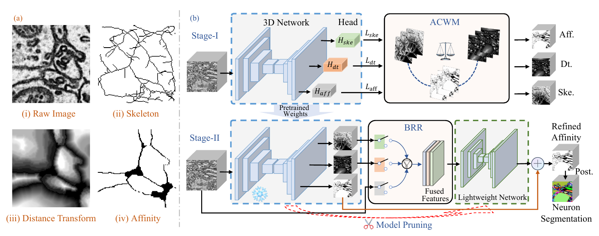

# 🧠 CTCL-NeuronSeg

**Collaborative Topology and Connectivity Learning for EM Neuron Segmentation**  
MICCAI 2026

Haoyuan Shi · Xiaoyu Liu · Yinda Chen · Jingcheng Xie · Zhiwei Xiong  
University of Science and Technology of China

[Code](https://github.com/vshy-dream/CTCL-NeuronSeg) | [Quick Start](#-quick-start) | [Results](#-results) | [Citation](#-citation)

## 🧭 Overview

> Official implementation of **CTCL**, a two-stage framework for affinity-based neuron segmentation in 3D electron microscopy.

<p align="center">
  
</p>

- **Stage-I · ACWM:** jointly learn affinities, skeletons, and distance transforms with adaptive task weighting.
- **Stage-II · BRR:** select and fuse complementary streams to refine affinity predictions.
- **Structural pruning:** reduce backbone channel widths using affinity-loss gradients.

## 📊 Results

Stage-II results reported in the paper. Lower is better.

| Dataset | VOI ↓ | ARAND ↓ |
| --- | ---: | ---: |
| AC3/4 | **0.7196** | **0.0586** |
| Wafer4 | **0.5193** | **0.0259** |
| CREMI-A | **0.5556** | **0.0701** |
| CREMI-B | **0.6830** | **0.0309** |
| CREMI-C | **1.0106** | **0.1433** |

## 🚀 Quick Start

### Installation

Python 3.8 · PyTorch 2.2.1 · CUDA 12.1. Waterz requires a C++ compiler.

```bash
conda create -n ctcl python=3.8 -y
conda activate ctcl
pip install torch==2.2.1 --index-url https://download.pytorch.org/whl/cu121
pip install -r requirements.txt
```

### Data

Set `DATA.data_folder` in `config/*.yaml` to your data root. HDF5 files use the key `main` and shape `[Z, Y, X]`; raw images are in the 0–255 range and labels contain instance IDs (background = 0).

| Dataset folder | File prefix | Training / test sections |
| --- | --- | --- |
| `ac3_ac4/` | `AC4`, `AC3` | AC4 first 80 / AC3 first 100; AC4 last 20 for validation |
| `cremi/` | `cremiA`, `cremiB`, `cremiC` | First 100 / last 25 |
| `wafer/` | `wafer4` | First 100 / last 25 |

Each prefix uses `_inputs.h5` and `_labels.h5`. Training also needs `_skeleton.h5`, generated from training labels with `utils.gen_skele.gen_skele_3d` (skeleton = 0, other voxels = 1). Distance targets are computed by the loader. Data and checkpoints are not bundled.

### Training and Inference

Run from the repository root. Below is an **AC3/4** example; configurations for all five volumes are in `config/`.

```bash
export CUDA_VISIBLE_DEVICES=0
S1=seg_3d_ac34_b2_skele_dt_11_bce_mse_hcl
S2=hcl_ac34_b2_skele_dt_11_raw_cascaded_MOE_hard_add_residual_nofinetune

# 1. Train Stage-I
python main_multi_task_0716.py -c "$S1"

# 2. Prune its checkpoint (replace STAGE1_RUN with your run directory)
python structural_pruning_final.py --cfg "$S1" \
  --checkpoint outputs/models/STAGE1_RUN/model-500000.ckpt \
  --ratio 0.3 --data 25000
```

Before Stage-II, set `MODEL.trained_model_name`, `trained_model_id`, and `pruned_model_path` in its YAML to the Stage-I run, checkpoint iteration, and generated pruning file (`outputs/models_pruning/ac4_pruned_model_ratio_0.3_25000.pth` for this example).

```bash
# 3. Train Stage-II
python main_multi_task_cascaded_add_pretrain_pruning.py -c "$S2"

# 4. Evaluate the cascade (replace STAGE2_RUN with your run directory)
python inference_cn_waterz.py -c "$S2" \
  -mn STAGE2_RUN -id 500000 -m ac3 -ts 100
```

Checkpoints are saved under `outputs/models/`; affinities, Waterz segmentations, and evaluation scores are saved under `outputs/inference/`. Evaluation requires raw images and instance labels.

## 📚 Citation

```bibtex
@inproceedings{shi2026ctcl,
  title={Collaborative Topology and Connectivity Learning for EM Neuron Segmentation},
  author={Shi, Haoyuan and Liu, Xiaoyu and Chen, Yinda and Xie, Jingcheng and Xiong, Zhiwei},
  booktitle={Medical Image Computing and Computer Assisted Intervention (MICCAI)},
  year={2026}
}
```

## 📬 Contact

[Haoyuan Shi](mailto:haoyuan.shi@mail.ustc.edu.cn) · [Zhiwei Xiong](mailto:zwxiong@ustc.edu.cn)
